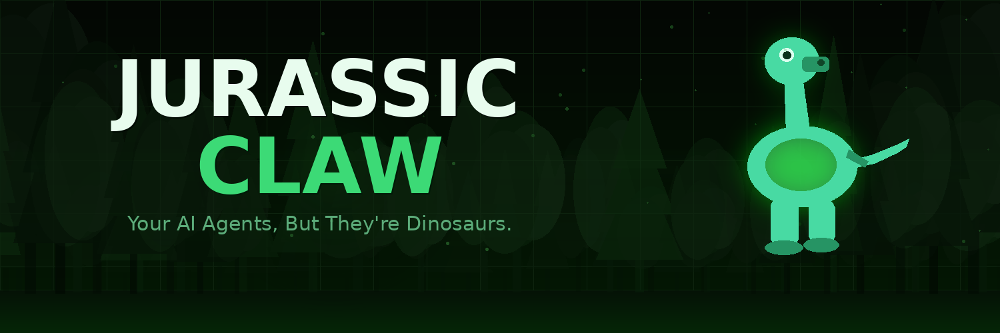

<div align="center">



<br/>

# 🦕 Jurassic Claw

**Your AI Agents, But They're Dinosaurs.**

Monitor autonomous Claude AI agents as roaming dinosaurs in a real-time live paddock.  
No more staring at terminal logs — watch your agents *charge*, *graze*, and *rest*.

<br/>

[](LICENSE)
[](https://nodejs.org)
[](https://anthropic.com)
[](https://railway.app)
[](https://x.com/jurassicclaw)
[](https://t.me/jurassicclaw)

<br/>

[**🦕 Launch App**](https://jurassic-claw-production.up.railway.app) · [**Quick Start**](#-quick-start) · [**OpenClaw Protocol**](#-openclaw-protocol) · [**Wiki**](../../wiki) · [**$JURA Token**](#-jura-token)

</div>

---

## 🌿 What is Jurassic Claw?

Jurassic Claw is a **real-time AI agent monitoring dashboard** that turns your Claude AI agents into animated dinosaurs roaming a live paddock.

- 🦖 **Charging T-Rex** = agent is working hard, calling tools
- 🦕 **Grazing Brachiosaurus** = agent is idle, waiting
- 🦴 **Resting fossil** = task completed
- 🔴 **Stomping Raptor** = error, check logs

Built on top of Anthropic's Claude API with a **Bring Your Own Key (BYOK)** model — your API key never touches our servers.

<br/>

## ✨ Features

| Feature | Status |
|---------|--------|
| 🦕 Live paddock — animated dino per agent | ✅ Live |
| ⚡ Real-time WebSocket feed | ✅ Live |
| 🔒 BYOK auth — key stored in localStorage only | ✅ Live |
| 💬 Direct chat with running agents | ✅ Live |
| 📂 FILES tab — view & download agent outputs | ✅ Live |
| 🔌 OpenClaw Protocol — connect external agents | ✅ Live |
| 📱 Telegram notifications | ✅ Live |
| 🔄 Session persist on server restart | ✅ Live |
| 👥 Team workspaces | 🔜 Phase 4 |
| 🏆 Public leaderboard | 🔜 Phase 4 |
| 🪙 $JURA token gating & free agent runs | 🦕 Phase 5 |

<br/>

## 🚀 Quick Start

### Option A — Use the hosted version

```
https://jurassic-claw-production.up.railway.app
```

Paste your Anthropic API key and start spawning agents immediately.

### Option B — Run locally

```bash
# 1. Clone
git clone https://github.com/jurassicclaw/Jurassicclaw.git
cd Jurassicclaw

# 2. Install
npm install

# 3. Configure
cp .env.example .env
# Edit .env — add your ANTHROPIC_API_KEY

# 4. Run
npm start

# 5. Open
open http://localhost:3333
```

### Option C — Deploy your own Railway instance

See [DEPLOY.md](DEPLOY.md) for the full step-by-step Railway guide.

<br/>

## 🦕 How It Works

```
User visits /setup
    ↓
Pastes Anthropic API key → stored in localStorage (never on server)
    ↓
Spawns agent: name + emoji + task
    ↓
Dinosaur appears in paddock → starts roaming
    ↓
WebSocket streams: logs · tool calls · status updates · file events
    ↓
Agent completes → dino rests · files available · Telegram notification sent
```

<br/>

## 🦖 Dino Status Guide

| State | Animation | Color | Meaning |
|-------|-----------|-------|---------|
| **Active** | Charging sprint | 🟢 Green | Processing, calling tools |
| **Thinking** | Steady trot | 🔵 Teal | Reasoning between steps |
| **Idle** | Slow graze | 🟡 Amber | Waiting for input |
| **Done** | Gentle rest | ⚪ White | Task completed |
| **Error** | Erratic stomp | 🔴 Red | Agent error |

<br/>

## 🔌 OpenClaw Protocol

Connect **any external AI agent** — LangChain, CrewAI, ElizaOS, custom scripts — to the paddock.

Your agent just needs to expose one endpoint:

```
GET /status   (on any port 8000–8020)
```

```json
{
  "name":        "My Agent",
  "task":        "Monitoring prices",
  "status":      "active",
  "progress":    42,
  "tokensUsed":  1240,
  "apiCalls":    7
}
```

Jurassic Claw auto-scans ports **8000–8020** on startup and every 30s. Once discovered, your agent gets its own dino in the paddock automatically.

**Status values:** `active` | `idle` | `done` | `error`

<br/>

## 📱 Telegram Notifications

Get notified every time an agent event happens — directly in your Telegram.

**Events:**
- 🦕 Agent spawned
- ✅ Task completed
- ❌ Agent error
- 🔌 OpenClaw agent discovered

**Setup:**

```bash
# 1. Create a bot via @BotFather on Telegram → /newbot
# 2. Copy the bot token
# 3. Add to your .env:
TELEGRAM_BOT_TOKEN=your_bot_token
TELEGRAM_CHAT_ID=your_chat_or_channel_id
# 4. Restart server
```

> Your dinos will text you. 📲

<br/>

## 🗂️ Project Structure

```
jurassicclaw/
├── backend/
│   ├── server.js              # Express + WebSocket server
│   ├── agentManager.js        # Agent lifecycle & Claude API integration
│   ├── openclawConnector.js   # External agent auto-discovery (ports 8000-8020)
│   └── telegramNotifier.js    # Telegram bot notifications
├── frontend/
│   ├── dashboard.html         # Main paddock UI
│   ├── setup.html             # BYOK API key entry
│   ├── landing.html           # Landing page
│   └── index.html             # Redirect stub
├── workspace/                 # Agent-created files (gitignored)
├── docs/                      # Images for README
├── .env.example               # Environment variables template
├── railway.json               # Railway deploy config
├── nixpacks.toml              # Build config
└── package.json
```

<br/>

## ⚙️ Configuration

Copy `.env.example` to `.env`:

```env
# Optional default API key (users can BYOK)
ANTHROPIC_API_KEY=sk-ant-...

# Telegram notifications (optional)
TELEGRAM_BOT_TOKEN=
TELEGRAM_CHAT_ID=

# Claude model
CLAUDE_MODEL=claude-haiku-4-5-20251001

# Server port (Railway sets this automatically — don't set manually)
PORT=3333
```

<br/>

## 🛠️ Tech Stack

| Layer | Technology |
|-------|-----------|
| Runtime | Node.js 18+ |
| Framework | Express.js |
| Real-time | WebSocket (ws) |
| AI | Claude API (Anthropic) |
| Frontend | Vanilla HTML/CSS/JS |
| Deploy | Railway |
| Storage | In-memory + filesystem |
| Notifications | Telegram Bot API |

<br/>

## 🗺️ Roadmap

```
Phase 1  ✅  Dashboard · WebSocket · Telegram · OpenClaw protocol
Phase 2  ✅  Hard reveal · GitHub open source · Telegram Notify · OpenClaw · Wiki
Phase 3  ⚡  v1.0.0 release · Good First Issues · Discussions · Leaderboard
Phase 4  🔜  Team workspaces · Agent templates · Paddock of the Week
Phase 5  🦕  $JURA on Solana · Token gating · Free agent runs · Governance
```

<br/>

## 🪙 $JURA Token

$JURA is the Jurassic Claw utility token on **Solana**, launching on **pump.fun** in Phase 5.

**Utility:**
- 🆓 Free agent runs for holders above threshold (no Anthropic key needed)
- ⚡ Priority access to faster models & higher rate limits
- 🗳️ Governance — vote on protocol & OpenClaw standard upgrades
- 🏆 Paddock of the Day — featured showcase for notable holder setups

> ⚠️ $JURA is a utility token. This is not financial advice. Crypto investments carry significant risk. Always verify the contract address via official channels before purchasing.

**Official channels:** [@jurassicclaw](https://x.com/jurassicclaw) · [t.me/jurassicclaw](https://t.me/jurassicclaw) · [jurassicclaw.xyz](https://jurassicclaw.xyz)

<br/>

## 🔒 Security

- API keys stored in **localStorage only** — never persisted server-side
- No user accounts, no server-side sensitive data storage
- Full codebase auditable — MIT licensed, open source
- No telemetry or analytics

<br/>

## 🤝 Contributing

Contributions welcome!

```bash
# Fork → branch → commit → PR
git checkout -b feature/my-feature
git commit -m "✨ add my feature"
git push origin feature/my-feature
```

**Wiki:** Full documentation at [github.com/jurassicclaw/Jurassicclaw/wiki](../../wiki)

**Good First Issues:** Check the [issues page](https://github.com/jurassicclaw/Jurassicclaw/issues?q=label%3A%22good+first+issue%22) for beginner-friendly tasks.

**Discussions:** Share your paddock setup, ideas, and feedback in [GitHub Discussions](https://github.com/jurassicclaw/Jurassicclaw/discussions).

**Areas we'd love help with:**
- 🔌 OpenClaw adapters for LangChain, CrewAI, AutoGen, ElizaOS
- 🎨 New dino animations and status visualizations
- 📊 Agent analytics and metrics dashboard
- 🌐 Translations / i18n

<br/>

## 📄 License

[MIT](LICENSE) — free to use, fork, and deploy.

If you build something cool with it, let us know on [Twitter](https://x.com/jurassicclaw)! 🦕

<br/>

---

<div align="center">

**🦕 Built with Claude API · Deployed on Railway · MIT License**

[jurassicclaw.xyz](https://jurassicclaw.xyz) · [@jurassicclaw](https://x.com/jurassicclaw) · [t.me/jurassicclaw](https://t.me/jurassicclaw)

</div>
